# 选课

```
以下内容来自学校教务处文件《学生网上选课操作说明》
```

一、登录系统
登录湖南农业大学信息门户，账号为学生学号，密码为学生在信息门户系统中的密码。同时浏览器建议选用谷歌浏览器进行登录。在信息门户中，点击进入【教务系统】。
 
二、查询课表
1.个人课表查询
依次点击【培养管理】-【我的课表】-【学期理论课表】，即可查询学生个人课表，如下图学期理论课表查询页面。

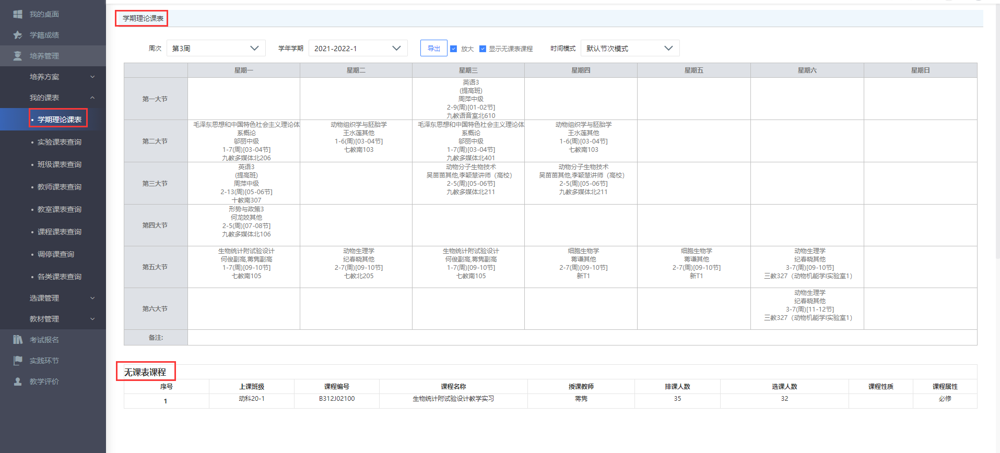

2.班级课表查询
请依次点击【培养管理】-【我的课表】-【班级课表查询】，即可查询班级课表，如下图班级课表查询页面。
 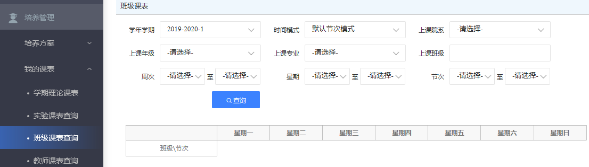
输入班级课表查询条件，点击【查询】按扭，即可完成班级课表查询，如下图班级课表页面。

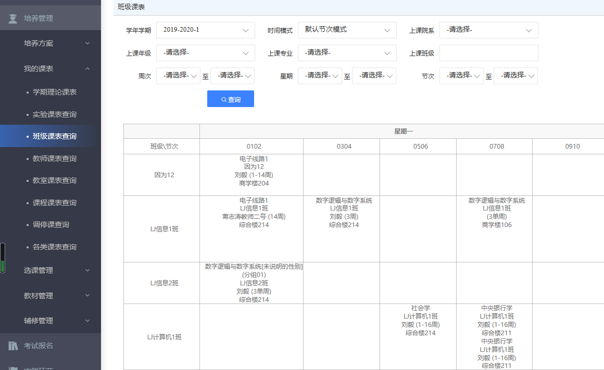

三、常规选课
1.在选课起止时间范围内学生可通过系统进行选课。依次点击【培养管理】-【选课管理】-【学生选课中心】，进入选课中心页面。
 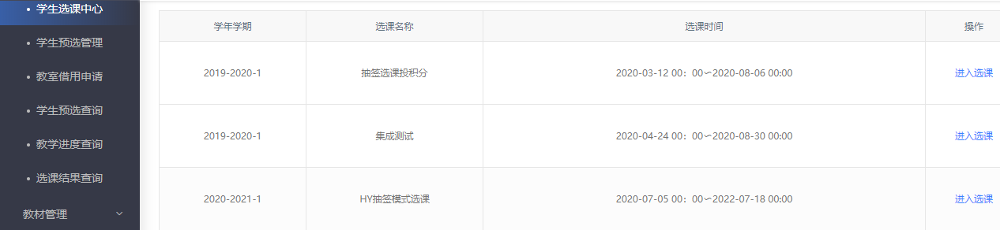
点击【进入选课】，进入选课课程页面。
 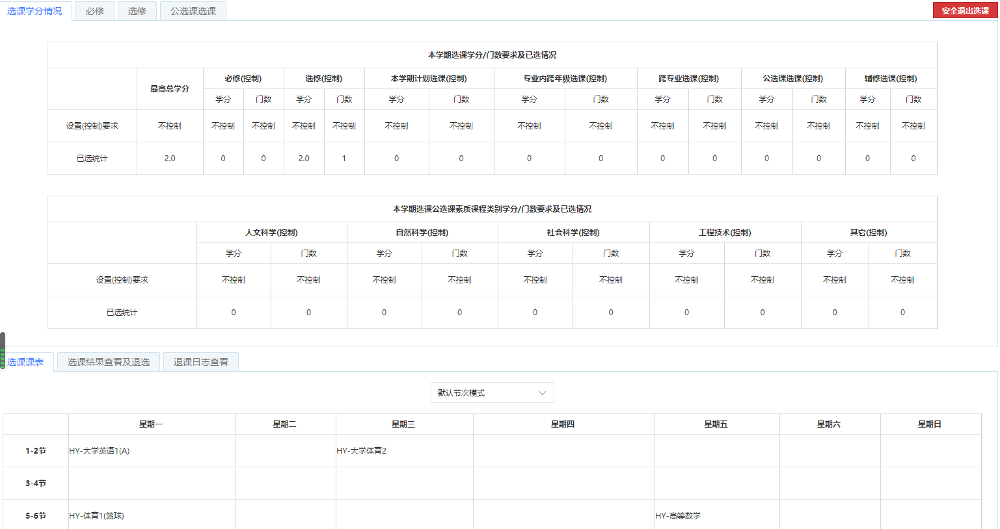
2.在【必修选课】中，选择需要选的公共必修课程，选择有余量的教学班，点击【选课】，即可完成选课操作；在【选修选课】中，选择需要选的专业限选课，选择有余量的教学班，点击【选课】，即可完成选课操作；在【公选课选课】中，选择需要选的公共选修课，选择有余量的教学班，点击【选课】，即可完成选课操作。针对已选课，如果想要退选，点击【退选】，即可完成退选操作。如下图学生选课页面。
 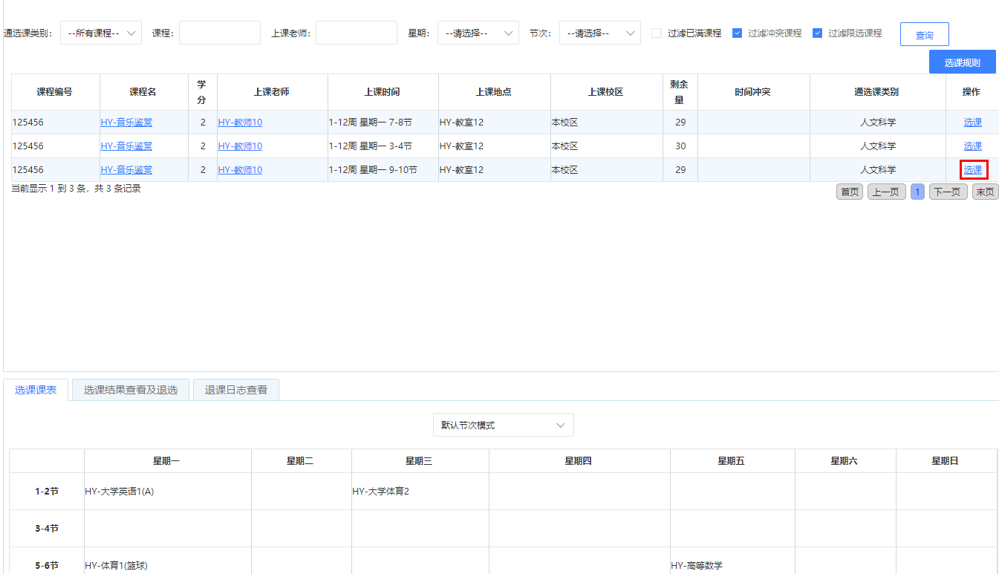
3.请依次点击【培养管理】-【选课管理】-【选课结果查询】，进入选课结果查询页面。
 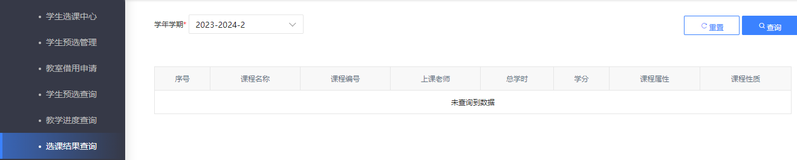
选择学年学期，点击【查询】按扭，即可进入选课结果查询页面。
 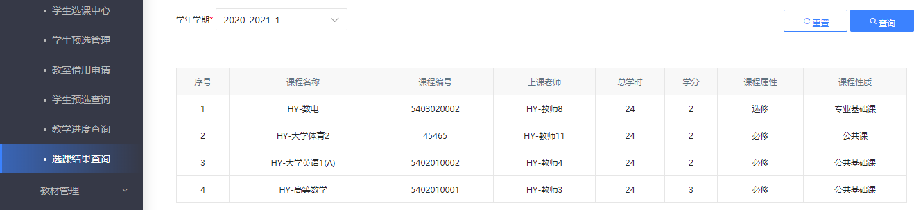
四、补修选课
1.请依次点击【考试报名】-【成绩管理】-【补修报名】，选择申请的学年学期，点击【查询】，进入到补修报名查询页面。
 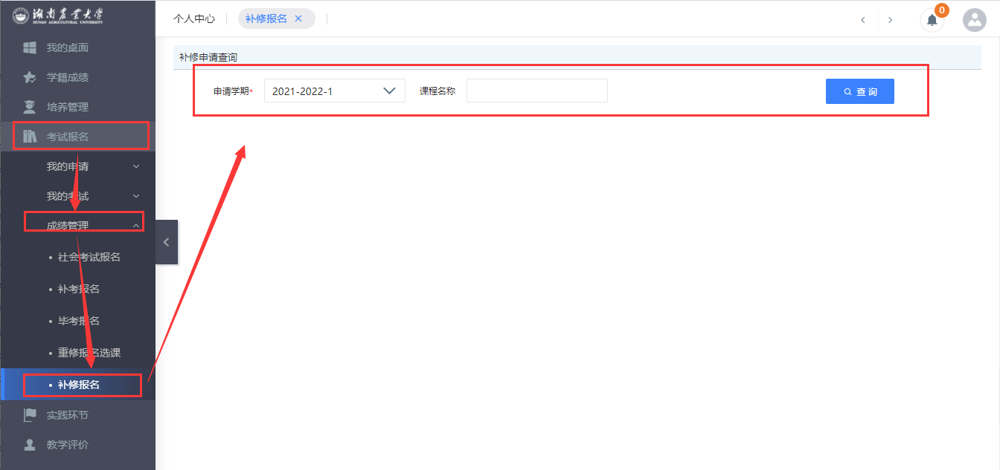
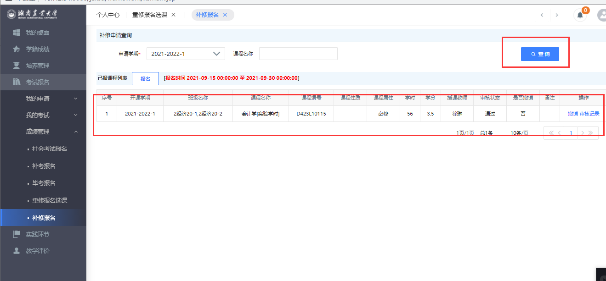

2.点击【报名】，进入可报课程列表，选择对应课程，点击课程信息后的【可选教学班】按钮，进入可选班级列表，选择合适班级，点击【确定】。
 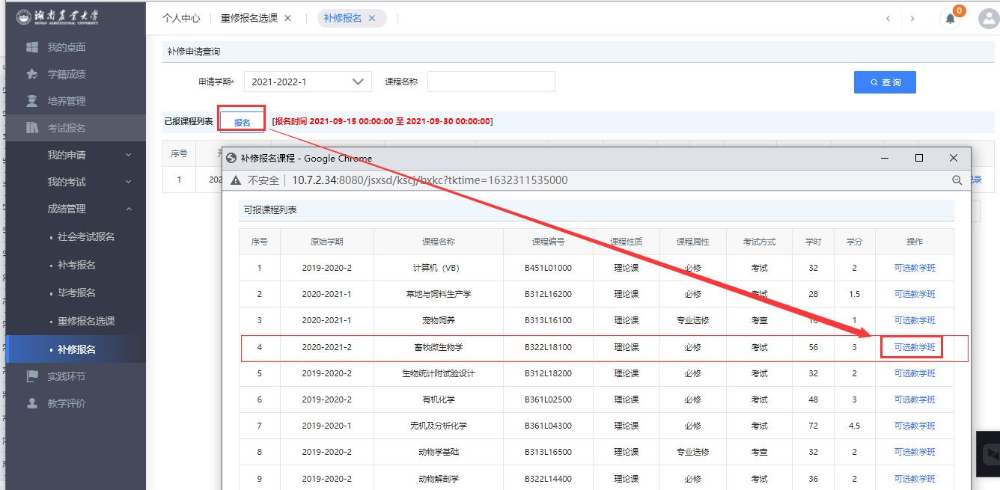

 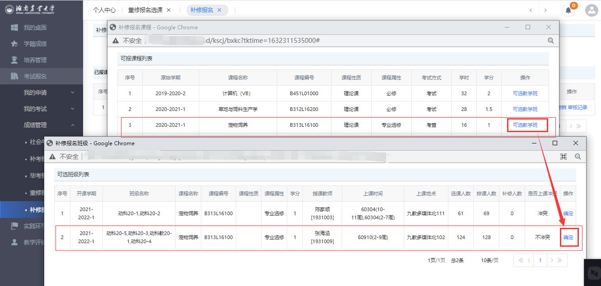

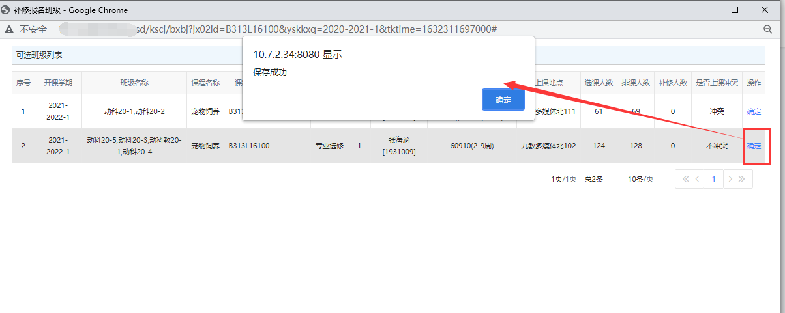
3.返回补修报名查询页面，点击【送审】按钮，选择对应【审核人】即可提交个人补修报名申请信息。

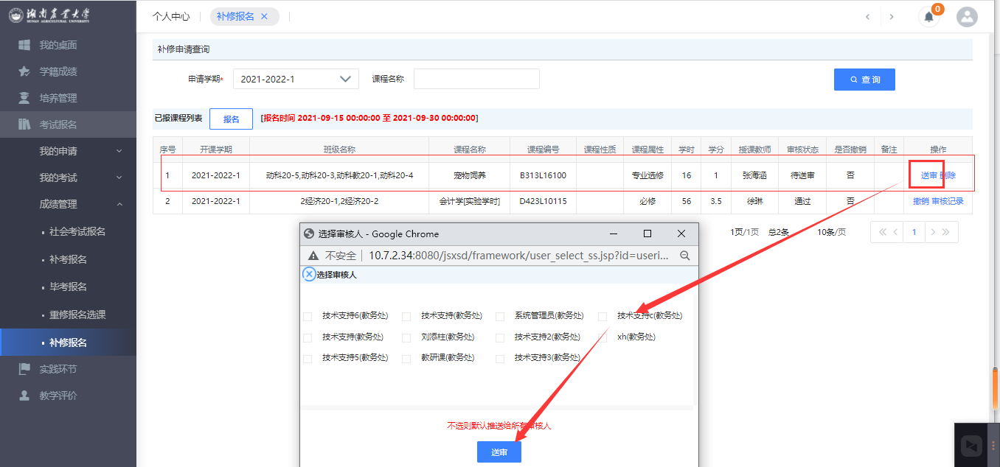
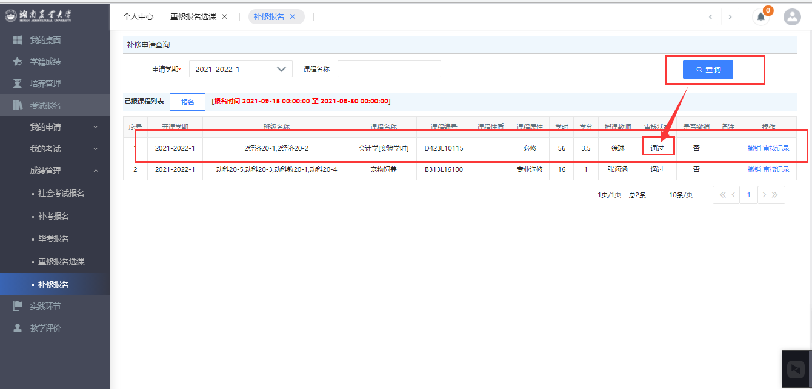
4.审核通过后，学生可在个人课表中查看到该课程。
